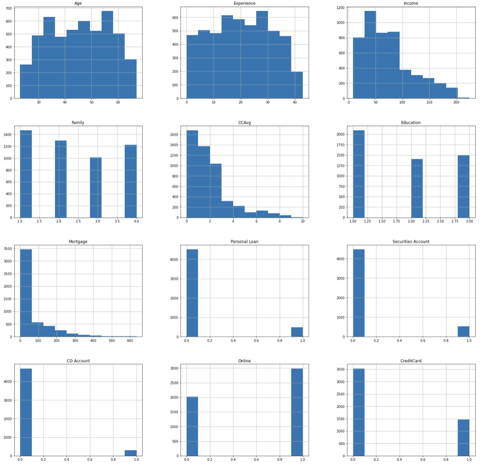

## [Machine Learning - Fibre Content Regression](https://ewang58.github.io/Machine-Learning-Fibre-Classification-Regression/)

**Project Overview**

-  In this project, a training dataset and a testing dataset are given. The data contains a 2-dimension label which denotes the cotton content and the polyester content in the fabric respectively

-  We will build and train 5 different regression models to see which models gives the best performance in terms of avoiding prediction errors and efficiency.

- The regression models that are used in this project include: Elastic Net, Lasso (L1), Ridge (L2), Multi-Layer Perceptron Neural Network(MLPNN), Support Vector Regression (SVR)

- [Read the full analysis here](https://ewang58.github.io/Machine-Learning-Fibre-Classification-Regression/)

  

---

---

## [Python - Personal Loan Analysis](https://ewang58.github.io/Personal-Loan-Analysis/)

**Project Overview**

- This case is about a bank (Thera Bank) whose management wants to explore ways of converting its liability customers to personal loan customers.
- We found that an individual's annual income and the number of family members are the most important factors in determining whether an individual accepts a personal loan from the bank.
- The libraries involved in the project include: Pandas, Matplotlib, Seaborn, and Plotly
- [Read the full analysis here](https://ewang58.github.io/Personal-Loan-Analysis/)

